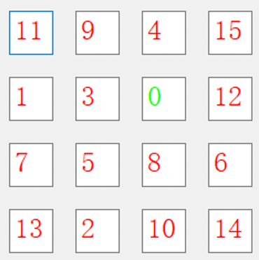
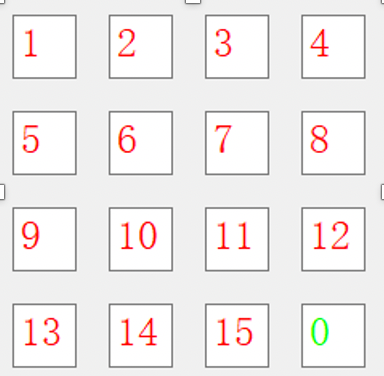

# 背景

15数码问题是人工智能中的一个经典问题。所谓的15数码问题：就是在一个4*4的16宫格棋盘上，摆放有15个将牌，每一个都刻有1-15中的某一个数码。本问题给定初始位置和目标位置，要求通过一系列的数码移动，将初始状态转化为目标状态。状态转换的规则：空格四周的数移向空格，我们可以看作是空格移动，它最多可以有4个方向的移动，即上、下、左、右。问题的求解方法，就是从给定的初始状态出发，不断地将空格上下左右的数码移至空格，将一个状态转化成其它状态，直到产生目标状态。左下图为初始状态，右下图为目标状态。

# 问题描述
初始状态和目标状态都是4*4的矩阵，我们分别对两个矩阵按从左到右从上到下的顺序连接起来成为一个有16个数字的序列（0是空格），并除去0得到两个15数字的序列。首先我们讨论最优解的存在性，这里分别计算两个序列的逆序数，于是要用到一个定理：设初始状态0所在的行数为i,目标状态0所在的行数为j，两者之差的绝对值为k。若k为奇数，则两个矩阵相应的逆序数的奇偶性相异才有解。若k为偶数，则两个矩阵的逆序数必须相同才有解。不是上述两种情况即为无解。通过初始判定就可以不用搜索就能直接否定无解情况。

# 算法描述
  A\*算法是一种静态路网中求解最短路径最有效的直接搜索方法，也是许多其他问题的常用启发式算法。评估函数公式表示为：f(n)=g(n)+h(n)，其中f(n)是从初始状态经由状态n到目标状态的代价估计，g(n)是在状态空间中从初始状态到状态n的实际代价， h(n)是从状态n到目标状态的最佳路径的估计代价， h\*(n)是从状态n到目标状态的最佳路径的实际代价。在这里还需要严格满足h(n)<=h\*(n) ，同时，衡量A\*算法的优劣也取决于启发式信息h(n)的选择，h(n)越接近h\*(n)，A\*算法效果越好。

算法流程如下： 
①	起始节点记作S，目标节点记作G，对于任意节点N，从S到当前节点N的总移动消耗记作 ，节点N各个数码位置到目标G各个数码位置的曼哈顿距离之和记作 。将起始节点S放入open表，open表是一个队列。 
②	判断open表是否为空，若为空，则搜索失败，目标节点不可达；否则，取出open表中估值函数 最小的节点P； 
③	判断结点P中的数码空格是否可以上下左右移动，假设对4个可能扩展的子节点P1至P4，如果结点不满足数码移动要求或者结点已经在close表或者open表中，则忽略，不进行扩展；否则扩展该结点，并更新结点的信息； 
④	将节点P移出open表，放入close表中。判断节点P是不是目标节点E，如果是，则搜索成功，搜索结束；否则，重复步骤2;  
在这个计算过程中， 取该结点在搜索树中的深度， 取结点中各个数码到目标状态各个数码的曼哈顿距离之和，可知 ，满足A*算法的要求。此外，还可以在这里考虑增强启发式信息的权重，可以得到一些不一定能找到最优解的的A算法，但在搜索效率上更高。如下是两种A算法的启发函数： 
①	h(n)取各个数码到目标位置曼哈顿距离之和的1.5倍，在搜索初期相对效率更高； 
②	h(n)中包括空格的边界信息，当空格信息在第一行或者第一列，启发函数加2
